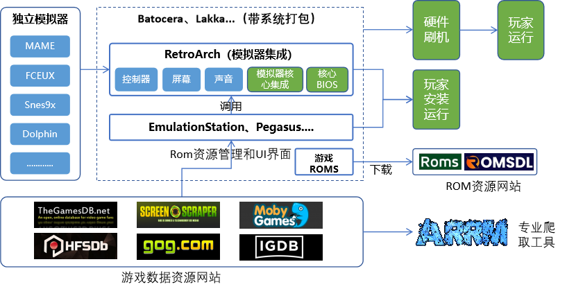
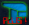
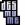
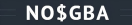
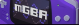
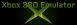
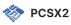
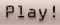
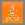
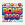

# Awesome-GameEmulator

Salute to the classics, as well as the outstanding individuals who have made contributions in the simulation field.

English | [简体中文](https://github.com/liminbai/awesome-GameEmulator/blob/main/README_zh.md)

## Emulator

### Arcade Emulators

* [MAME](https://www.mamedev.org/) MAME is a multi-purpose emulation framework.
* [AdvanceMAME](https://www.advancemame.it/) The Advance Projects allow you to play Arcade games with video hardware like TVs, Arcade monitors, PC monitors and LCD screens. They run in GNU/Linux, Mac OS X, DOS and Windows.
* [FBAP](http://fbap.1emu.net/) FB Alpha is an arcade emulator.
* [FBNeo](https://github.com/finalburnneo/FBNeo) FBNeo, or FinalBurn Neo, is a multi-system arcade emulator designed for retro gaming enthusiasts. It emulates a wide range of classic arcade games and consoles, such as Capcom CPS-1, CPS-2, CPS-3, Neo Geo, and Sega System 16, among others. FBNeo focuses on accurate emulation and high performance, supporting advanced features like netplay, rewinding, and shader effects. It's a continuation of the FinalBurn and FinalBurn Alpha projects, aiming to provide a comprehensive and user-friendly platform for preserving and enjoying vintage games on modern systems .
* [WinKawaks](https://www.kawaks.org) Kawaks, The BEST arcade game emulator for Capcom and NeoGeo games. When it released, the emulation enthusiast prefers Kawaks. Thank you guys!
* [Teknoparrot](https://teknoparrot.com) TeknoParrot is a software package allowing you to run selected PC-based arcade titles on your own hardware, with full support for keyboard and mouse controls, gamepads, steering wheels, and joysticks.
* [Supermodel](https://www.supermodel3.com/) Supermodel emulates Sega's Model 3 arcade platform, allowing you to play a number of ground-breaking arcade classics on your PC. It uses OpenGL and the SDL library, and can run on Windows, Linux, and Mac OS X.
* [Hypseus Singe](https://github.com/DirtBagXon/hypseus-singe.git) Hypseus is a fork of [Matt Ownby's Daphne](http://www.daphne-emu.com/).Daphne is Multiple Arcade Laserdisc Emulator!  It's a program that lets one play the original versions of many laserdisc arcade games on one's PC.

### Nintendo Emulators

#### Nintendo NES Emulators

* [FCEUX](https://fceux.com) The all in one NES/Famicom/Dendy Emulator.
* [Jnes](https://www.jabosoft.com/jnes) Jnes is an emulator for the original 8-bit Nintendo Entertainment System (NES) with an enjoyable and intuitive user interface which has been translated into 20 languages. Whether you are looking to instantly save your game progress or record a movie for friends you'll find it here. Compatibility tends to focus on North American and European games, although there is support for many popular Japanese games.
* [VirtuaNES](http://virtuanes.s1.xrea.com/) VirtuaNES is Famicom/NES emulator for Win32 Programmed by Norix.
* [Nestopia](https://nestopia.sourceforge.net) A very good FC Emulator.
* [Nintendulator](https://www.qmtpro.com/~nes/nintendulator/) Nintendulator is an open source Win32 NES emulator written in C++.

#### Super Nintendo Emulators

* [ZSNES](https://www.zsnes.com) ZSNES is a Super Nintendo emulator programmed by zsKnight and \_Demo\_. On April 2, 2001 the ZSNES project was GPL'ed and its source released to the public. It currently runs on Windows, Linux, FreeBSD, and DOS. Remember that this is a public beta so don't expect this to run on your machine.
* [Snes9x](http://www.snes9x.com/) Snes9x is a portable, freeware Super Nintendo Entertainment System (SNES) emulator. It basically allows you to play most games designed for the SNES and Super Famicom Nintendo game systems on your PC or Workstation; which includes some real gems that were only ever released in Japan.

#### Nintendo 64 Emulators

* [cooln64](https://cooln64.app/) CoolN64 is the fastest and most accurate N64 emulator. 
* [Project64](https://www.pj64-emu.com) Breathe new life into your favourite retro N64 games with Project64.
* [Mega64](https://mega64.com/) Another fan-favorite, the MegaN64 is an upgrade of the Mupen64+, and over 900,000 Android users enjoy it every month judging by all of the positive reviews that it has.

#### Nintendo WII&WII U Emulators

* [Dolphin](https://dolphin-emu.org/) is an emulator for two recent Nintendo video game consoles: the **GameCube** and the **Wii**. It allows PC gamers to enjoy games for these two consoles in **full HD** (1080p) with several enhancements: compatibility with all PC controllers, turbo speed, networked multiplayer, and even more!
* [Cemu](https://cemu.info) Software to emulate Wii U games and applications on PC.

#### Nintendo Switch Emulators

* [Yuzu](https://yuzu-emulator.net) is an open-source emulator that allows you to play Nintendo Switch games on platforms such as Windows, Android and Linux.
* [Ryujinx](https://ryujinx-emulator.com) Ryujinx is an open-source Nintendo Switch emulator for Windows, Mac and Linux devices.

#### Nintendo DS Emulators

* [DeSmuME](http://desmume.org/) Nintendo DS Emulator.
* [No$GBA](https://www.nogba.com) GBA and Nintendo DS Emulator for Windows.
* [ENSATA](https://www.ndsemulator.com/nintendo-ds/ensata.htm) The ensata Nintendo DS (code name NITRO) Software Emulator was developed by Nintendo IntelSys as a Debug Target for development of NITRO applications.
* [iDeaS](https://www.ndsemulator.com/nintendo-ds/ideas.htm) New emulator development found for the NDS. Its called IDeaS which the symbolic of Ideas and DS (obviously). The second best (after DeSmuME) emu progressing so far.
* [DUALIS](https://www.ndsemulator.com/nintendo-ds/dualis.htm) Dualis is a plugin-based DS emulator for x86/Win32 computers.
* [DSemu](https://www.ndsemulator.com/nintendo-ds/dsemu.htm) DSEmu is an open source Nintendo DS Emulator written by Imran Nazar and released under the BSD License.

#### Nintendo GBA Emulators

* [Visual Boy Advance | GBA Emulator](https://visualboyadvance.org) Visual Boy Advance is an open-source Game Boy Advance (GBA) emulator for Windows, Mac, Linux, Android and IOS devices.
* [mGBA](https://mgba.io/) mGBA Game Boy Advance Emulator.

### Xbox Emulators

* [Xenia](https://xbox360emulator.com) Xenia is a free and open-source Xbox 360 Emulator written in C++ for Windows & Linux. An unofficial version ported to Android is also available.

### Sony Emulators

#### PlayStation 1

* [ePSXe](https://www.epsxe.com) PlayStation 1 emulator.
* [DuckStation](https://duckstation.org/) DuckStation is a PS1 Emulator aiming for the best accuracy and game support.
* [PCSXR](https://ps1emulator.com/) PlayStation 1 Emulator.
* [FPseNG](https://www.fpsece.net/) FPse64 is the best PSone emulator for Android devices.

#### PlayStation 2

* [PCSX2](https://pcsx2.net) PCSX2 is a free and open-source PlayStation 2 (PS2) emulator. Its purpose is to emulate the PS2's hardware, using a combination of MIPS CPU Interpreters, Recompilers, and a Virtual Machine that manages hardware states and system memory.
* [AetherSX2](https://aethersx2.net/)is a PlayStation 2 emulator that enables users to play PS2 games on iOS, Android, Mac, Windows PC, Linux users can play their favorite games from the PS2 console without the need for a physical PS2 console.
* [Play!](https://purei.org/) Play! is a PlayStation2 emulator for Windows, macOS, UNIX, Android, iOS & web browser platforms.

#### PlayStation 3

* [RPCS3](https://rpcs3.net) RPCS3 is a multi-platform open-source Sony PlayStation 3 emulator and debugger written in C++ for Windows, Linux, macOS and FreeBSD.

#### PlayStation 4

* [shadPS4](https://shadps4.net) shadPS4 is an early PlayStation 4 emulator for Windows, Linux and macOS.

#### PSP

* [ppsspp](https://www.ppsspp.org) a fast and portable PSP emulator.
* [jpcsp](https://github.com/jpcsp/jpcsp) Java PSP Emulator.

#### PSV

* [Vita3K](https://vita3k.org/) The world's first functional PlayStation Vita emulator.

### Sega Emulators

* [Gens](http://gens.me/) Sega MD emulator.
* [Yabause](http://yabause.org) Yabause is a Sega Saturn emulator under GNU GPL. It currently runs on FreeBSD, GNU/Linux, Mac OS X, Windows and Dreamcast.
* [SSF](https://ssftribute.csdprojects.co.uk) Sega Saturn emulator.
* [Demul](http://demul.emulation64.com/) *Sega* Dreamcat(DC) emulator.

## Emulator integrated UI

* [OpenEmu](https://openemu.org) OpenEmu is about to change the world of video game emulation. One console at a time...
* [Pegasus](https://pegasus-frontend.org) Pegasus A cross platform, customizable graphical frontend for launching emulators and managing your game collection.Pegasus is a graphical frontend for browsing your game library and launching all kinds of emulators from the same place. It's focusing on customizability, cross platform support (including embedded) and high performance.
* [BizHawk](https://github.com/TASEmulators/BizHawk) EmuHawk is a multi-system emulator written in C#. As well as quality-of-life features for casual players, it also has recording/playback and debugging tools, making it the first choice for TASers (Tool-Assisted Speedrunners).
* [Retroarch](https://www.retroarch.com)  RetroArch is a frontend for  emulators, game engines and media players.
* [EmulationStation](https://emulationstation.org) A graphical and themeable emulator front-end that allows you to access all your favorite games in one place, even without a keyboard!
* [ES-DE](https://es-de.org/) ES-DE is a frontend for browsing and launching games from your multi-platform collection. It comes preconfigured for use with a large selection of emulators, game engines, game managers and gaming services. It can also run locally installed games and applications. It's fully customizable, so you can easily expand it with support for additional systems and applications. 
* [RetroBat](https://www.retrobat.org) **RetroBat** is a software distribution designed for emulation and to be the easiest way to enjoy your game collection on your **Windows** computer. The supplied **EmulationStation** interface is fully functional and highly customizable. You can run all your games from it and search online for visuals to enhance the presentation of your collection.
* [Higan](https://github.com/higan-emu/higan)  It currently emulates the following systems: Famicom, Famicom Disk System, Super Famicom, Super Game Boy, Game Boy, Game Boy Color, Game Boy Advance, Game Boy Player, SG-1000, SC-3000, Master System, Game Gear, Mega Drive, Mega CD, PC Engine, SuperGrafx, MSX, MSX2, ColecoVision, Neo Geo Pocket, Neo Geo Pocket Color, WonderSwan, WonderSwan Color, SwanCrystal, Pocket Challenge V2.
* [ARES](https://ares-emu.net/) ares is a cross-platform, open source, multi-system emulator, focusing on accuracy and preservation.
* [BizHawk](https://ares-emu.net/) BizHawk is a multi-platform emulator with full rerecording support and Lua scripting.
* [Mednafen](https://mednafen.github.io/) Mednafen is a portable, utilizing OpenGL and SDL, argument(command-line)-driven multi-system emulator.
* [Xiaoji](https://www.xiaoji001.com/) 我们的工作室正式成立，并命名为《小鸡工作室》。为啥叫小鸡？俺是雷布斯的脑残粉，为了向小米致敬，俺的工作室就叫小鸡啦。
* [Arcadepunks](https://www.arcadepunks.com) Are you ready to dive into the golden age of gaming? Arcade Punks is your one-stop shop for everything retro gaming: from ready-to-play gaming images and news, to reviews, tutorials, and emulators. Whether you’re a seasoned retro gamer or a curious newbie, we’ve got something for everyone!
* [GameEx](https://www.gameex.com/) GameEx is considered to be the most powerful, stable and feature rich gaming front-end (emulator launcher) for MAME, GameBase, Daphne, PC Games and all command line based game emulators, along with being a complete Home Theatre PC solution or plug in for windows media center. It’s designed to be used seamlessely with arcade controls and various arcade products and also has fully featured tuchscreen and tablet support suitable to be used as a CarPC and touchscreen frontend. GameEx and its related online services are completely free.

## Emulator integrated system

* [Batocera](https://batocera.org) Batocera.linux is an open-source and completely free retro-gaming distribution that can be copied to a USB stick or an SD card with the aim of turning any computer/nano computer into a gaming console during a game or permanently.
* [Lakka](https://www.lakka.tv) Lakka is a lightweight Linux distribution that transforms a small computer into a full blown retrogaming console.
* [EmuELEC](https://github.com/EmuELEC/EmuELEC) Retro emulation for Amlogic devices. Based on [CoreELEC](https://github.com/CoreELEC/CoreELEC) and [Lakka](https://github.com/libretro/Lakka-LibreELEC) with tidbits from [Batocera](https://github.com/batocera-linux/batocera.linux). I just combine them with [Batocera-Emulationstation](https://github.com/batocera-linux/batocera-emulationstation) and some standalone emulators ([Advancemame](https://github.com/amadvance/advancemame), [PPSSPP](https://github.com/hrydgard/ppsspp), [Reicast](https://github.com/reicast/reicast-emulator), [Amiberry](https://github.com/midwan/amiberry) and others).
* [Recalbox](https://www.recalbox.com) Replay **all the consoles, arcades, and computers** of your childhood.
* [RetroPie](https://retropie.org.uk) RetroPie allows you to turn your Raspberry Pi, ODroid C1/C2, or PC into a retro-gaming machine. It builds upon Raspbian, EmulationStation, RetroArch and many other projects to enable you to play your favourite Arcade, home-console, and classic PC games with the minimum set-up. For power users it also provides a large variety of configuration tools to customise the system as you want.

## GameROMS

* [Mameromsfree](http://www.mameromsfree.com) This site is dedicated to everything MAME from Roms and MAME Emulators and all available for free fast download to your phone or tablet PC.  No Adverts just Cool ROMs for the MAME.
* [Gamulator](https://www.gamulator.com) Emulators&Roms download
* [Planetemu](https://www.planetemu.net) Emulators&Roms download
* [Mobygames](https://www.mobygames.com) Roms Resources summary
* [Romsdownload](https://romsdownload.net) There are lot of ROM  games and  Emulators available on the RomsDownload.net. You can spend a lot of time looking for them, or you can simply find anything that you need on our website. The most popular games such as: Super Mario, Pokemon, Contra, Zelda, Crash Bandicoot, Tekken 3, God of War, Grand Theft Auto, Monster Hunter and respective emulators for Nintendo, PS1, PS2, PSP, Wii, GameCube, GBA can be easily downloaded on our website. Grab your best friends, two joysticks and prepare for your adventure in the past with our cool retro games! We will provide you with the big collection of emulators and the most popular roms for downloads. Whether you want to play games on your PC, tablet or mobile device, we have roms for android, iOS and PC as well as emulators.Best video game consoles Emulator software.
* [Romsfun](https://romsfun.com) Download over 50.000 classic and modern games for free. We share the full ROM and ISO of the latest Nintendo and Playstation platforms. Here you can download Redump and No-Intro validated ROMs for free. In addition, we also have some Pokemon hacking games, Mods.
* [Romulation](https://www.romulation.org/) We have helped people experience classic video games since 2004.Our collection of 30,766 console game ROMs has been extensively tested for emulator compatibility and your safety.
* [Retrostic](https://www.retrostic.com/) Dear retro players, Retrostic aims to deliver every possible archived retro game in a form of ROM or ISO. In the emulator section of the website, you can find loads of emulators you can use to run these ROM and ISO files and enjoy your gaming experience. Our goal is providing direct download links with no .exe files, viruses or disturbing advertisements. We have an extensive game database that counts over 70 000 titles for 40+ consoles. If you simply can't find a game, use the request game page and we will deliver it on our website in no time.
* [CDRomance](https://cdromance.org) CDRomance is an engaging online community and archive dedicated to preserving the heritage of video gaming with a focus on fan contributions. Our collection showcases a wide range of fan-made mods, mods/hacks, translations, and original games, as well as freeware and abandonware titles. These contributions rejuvenate classic and obscure games alike, broadening access to treasures of the past. Emphasizing the diversity of fan-created content, CDRomance plays a crucial role in keeping the history of video games alive and evolving. Our archive spans from the pioneering 8-bit home computer games to the complex stories of the sixth generation (128-bit era, mid-2000's), covering early DOS, SCUMM-based adventures, and the initial wave of Windows gaming. Committed to the ethical and non-commercial distribution of games, CDRomance offers a valuable resource for game enthusiasts and historians, celebrating the ongoing creativity and dedication of the gaming community.
* [Emuparadise](https://www.emuparadise.me) Looking for retro video games? You've come to the right place! You will find tons of roms, isos and games here. Download and play them with an emulator or play them right inside your browser window!.
* [EdgeEMU](https://edgeemu.net) EdgeEMU’s archive contains over 55,000 game titles. These games belong to various consoles and setups, including Gameboy Advance, MAME, Nintendo, Atari, Amstrad, and Commodore.
* [RomWorld](https://www.romworldonline.com) Welcome to ROM World. A website dedicated to **snes roms** and roms for other systems as well as emulation. We have many snes roms available for our users to download absolutely free. We also have roms for gba, sega mega drive, sega master system, sega genesis, mame, Nintendo DS and N64. In addition we also have the emulators for you to play the roms on.
* [WoWroms](https://wowroms.com) The multilanguage-supported WoWroms is another website that can replace Vimm’s Lair completely. With it, we can download ROMs, ISOs, and emulators for systems like Playstation, Nintendo, MAME, and Gameboy.
* [Romspedia](https://www.romspedia.com) Free ROMs Download for Android, PC, Mac or iPhone.
* [Emurom](https://emurom.net) Arcade and Console ROMs Emulation.
* [Roms2000](https://roms2000.com) Welcome to our ROMs games download page. This is where you’ll find all types of retro ROMs for different systems that you can download so you can enjoy your favorite games on PC and mobile devices.
* [KillerRoms](https://roms-download.com/) ROMS, FREE RETRO ROMS ANDROID/WINDOWS. 
* [Coolrom](http://www.coolrom.eu/) CoolRom is No1 for Roms & Emulators.
* [RomsGames](https://www.romsgames.net/) Download Roms & Emulators.
* [Romsdl](https://romsdl.com/) Have a look at the biggest collection of retro console games and get the chance to play the games from your childhood. Select the console, download your favorite cartridge games and start playing them on your phone or computer using the variety of emulators offered at RomsDL.
* [ROMHustler](https://romhustler.org) Download Roms & Emulators.
* [nsw2u](https://nsw2u.com/) Download Roms & Emulators.

## ROM Manager

* [RomM](https://github.com/rommapp/romm) RomM (ROM Manager) allows you to scan, enrich, browse and play your game collection with a clean and responsive interface. With support for multiple platforms, various naming schemes, and custom tags, RomM is a must-have for anyone who plays on emulators.
* [oxyROMon](https://github.com/alucryd/oxyromon/) oxyROMon is a cross-platform opinionated CLI ROM organizer written in Rust. Like most ROM managers, it checks ROM files against known good databases. It is designed with archiving in mind, so it only supports original and lossless ROM formats. It can, however, export in various popular lossy formats, leaving the lossless ROM files untouched. Sorting can be done in regions mode, in so-called 1G1R mode, or both. Console, computer, and arcade (WIP) systems are supported using Logiqx DAT files. The first two require No-Intro or Redump DAT files, while the latter uses MAME or FBNeo DAT files.
* [Romcenter](https://www.romcenter.com/) Romcenter (RC) is a rom manager, a program with which you can manage collections of games supported by an emulator.
* [ClrMamePro](https://mamedev.emulab.it/clrmamepro/) ‌ClrMamePro‌是一款专业的ROM管理工具，主要用于管理和验证ROM文件的完整性和一致性。
* [Steam ROM Manager](https://steamgriddb.github.io/steam-rom-manager/) Want to play some old or new emulator games on your couch? Adding them to steam gives you access to the steam overlay, excellent controller management, and even in home and remote streaming. Adding your emulator games manually is a huge pain, but fear not! Introducing Steam ROM Manager, the bulk game importer and artwork manager for Steam!
* [SimUI](https://www.simui.net/) SIMUI (Simplify Integrate Mouse UI) 是由热爱模拟游戏文化的玩家开发的免费专业游戏ROM管理软件。
* [Retrom](https://github.com/JMBeresford/retrom.git) Retrom is a centralized game library management service that allows you to host your games on a single device, and connect clients on any amount of other devices to (un)install/download and play them when and where you want to! Think of it as a sort of self-hosted Steam for your DRM-free game library.
* [RomVault](https://www.romvault.com/) RomVault will take one or more DAT files and your set of ROM (zip) files, and clean up your files to match your DAT files. If you find more ROMs to add to your collection RomVault will scan and merge in these files, and if new DATs are released you can easily scan in these new DATs and update your ROM collections to match, all of this can be done with just a few button clicks in the UI.

## Forum community & Tools

* [NesDev](https://www.nesdev.org) A community of homebrew game developers and hardware researchers for the Nintendo Entertainment System (NES) and other retro consoles.
* [ngemu](https://www.ngemu.com) A forum community dedicated to all emulation enthusiasts. Come Join discussion on all platforms from Nintendo, Microsoft Xbox, Sony Playstation, to PC. Coding, tips, builds, specs, tricks and more.
* [emu-france](http://www.emu-france.com) Créé par Avery Lee (l’auteur deVirtualDub), il s’agit d’un émulateur d’Atari 8 bits (800/800XL/130XE) disponible en 32 et 64 bits.
* [EmuCR](https://www.emucr.com) Latest emulators for PS5,PS4,NS,PS3,WiiU,Wii,PS2,Xbox360,Xbox,3DS,PSV,PS,NDS,PSP,GBA,N64,DC,Arcade and many other systems.
* [围炉Go](https://www.wlgooo.com/) 围炉Go社区有经典电脑单机，老漫画。主机、掌机汉化发布,文学心得创作,各类合集与工具分享。精品图文内容呈现，制作人们的分享创作舞台，全网最精致的典藏内容。
* [Emulab](https://www.emulab.it/) Simulator and Simulation Software Community.
* [Emutalk](https://www.emutalk.net/) Simulator and Simulation Software Community.
* [Freeemulator](https://freeemulator.com) FREE VIDEO GAME EMULATORS 
* [GBAtemp](https://gbatemp.net/) GBAtemp.net is an independent gaming community.
* [Segaretro](https://segaretro.org/) Welcome to Sega Retro, a project from the people behind Sonic Retro. We aim to cover everything possible about Sega from the 1940s to today. We currently are working on 46,214 articles and have many more that are requested to be worked on.
* [Fightersgeneration](https://www.fightersgeneration.com/) The Ultimate Fighting Game Resource.
* [jujuvincebros](http://jujuvincebros.fr/) The website built by two brothers who love games is also the place where the ARRM tool can be downloaded.
